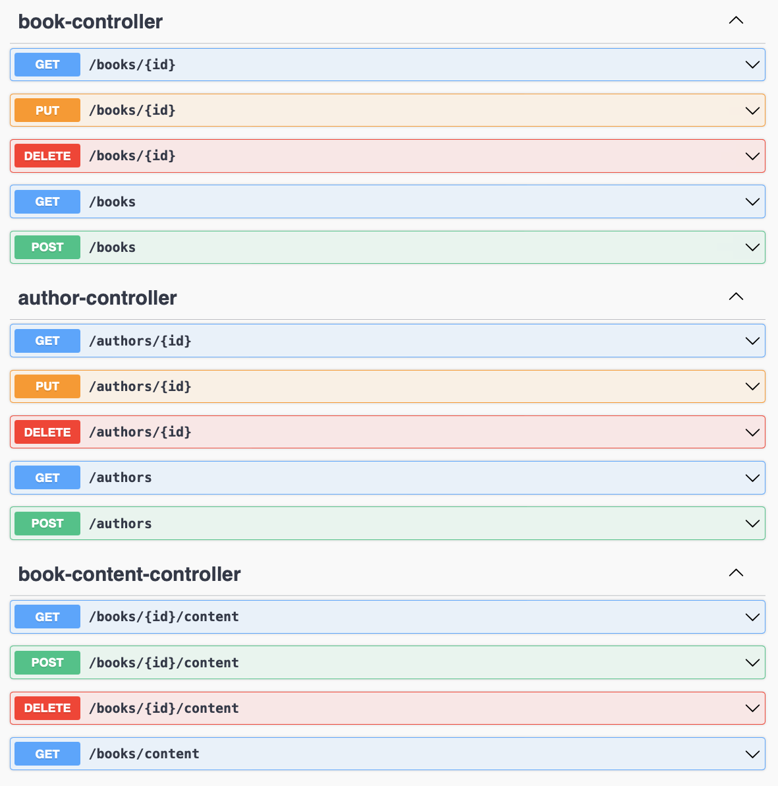

# Bachrlorproef REST API
Onder de map Bibliotheek vindt u de niet geoptimiseerde REST API dat ik tijdens mijn bachelorproef zal besturderen.
Het is een simpele CRUD applicatie dat boeken en auteuren kan bijhouden.

De applicatie bevat de volgende endpoints:

## Usage
* Installeer Java 17
* Installeer Maven
* Maak een postgresql databank
* Vervang postgresql config in application.properties
* Installeer de dependencies: **mvn clean install**
* Run: **mvn clean spring-boot:run**

## Stress test usage
* Install K6 (<a href="https://k6.io/docs/get-started/installation/" target="_blank">link</a>)
* Navigate to **scripts/** directory
* run: **k6 run ./k6-stress-test.js**
